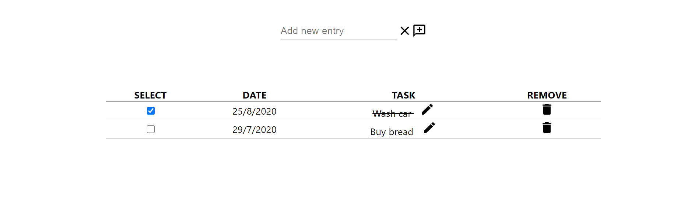

# To-do app

## Demo 

## Functionalities 
* Add new entry by typing in the input field - date is automatically initialized with the current date
* On click select - the text is strikethrough in order to show the task was completed
* On click remove - the item is deleted
* On click edit (pen icon) - an input field appears
* On click save (disk icon) - the changed input from the edit button is saved
